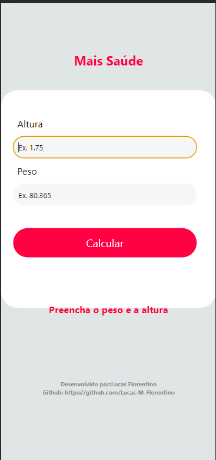

# Mais Saúde - Calculadora de IMC

> App para aferição de IMC, ainda está básico porem pretendo adicionar mais funcionalidades

## Sumário

- [Sobre o Projeto](#sobre-o-projeto)
- [Pré-requisitos](#pré-requisitos)
- [Instalação](#instalação)
- [Uso](#uso)
- [Contribuição](#contribuição)
- [Licença](#licença)

## Sobre o Projeto

Este é um aplicativo móvel desenvolvido com React Native que permite aos usuários calcular seu Índice de Massa Corporal (IMC). O IMC é uma medida simples que ajuda a avaliar o peso corporal em relação à altura, auxiliando no monitoramento da saúde e do condicionamento físico.

### Funcionalidades

- Calculadora de IMC
- [Adicione aqui outras funcionalidades]

### Capturas de Tela

## Pré-requisitos

- [Node.js](https://nodejs.org/) - Certifique-se de ter o Node.js instalado.
- [React Native CLI](https://reactnative.dev/docs/environment-setup) - Siga as instruções para configurar o ambiente React Native.
- [Git](https://git-scm.com/) - Para clonar o repositório.

## Instalação

1. Clone o repositório:

git clone https://github.com/seu-username/mais-saude.git

2. Navegue até o diretório do projeto:

cd mais-saude

3. Instale as dependências:

npm install

4. Inicie o aplicativo no simulador ou em um dispositivo físico:

npm run start

Siga as instruções no aplicativo para calcular o seu IMC.

## Contribuição
Contribuições são bem-vindas! Se você deseja contribuir para o projeto, siga os passos 
abaixo:

1. Faça um fork do projeto
2. Crie uma branch para sua feature (git checkout -b feature/sua-feature)
3. Faça commit das suas mudanças (git commit -m 'Adicione sua feature')
4. Faça push para o branch (git push origin feature/sua-feature)
5. Abra um pull request
## Licença
Este projeto está licenciado sob a Licença MIT - veja o arquivo LICENSE para detalhes.

Feito com ❤️ por Lucas Florentino
